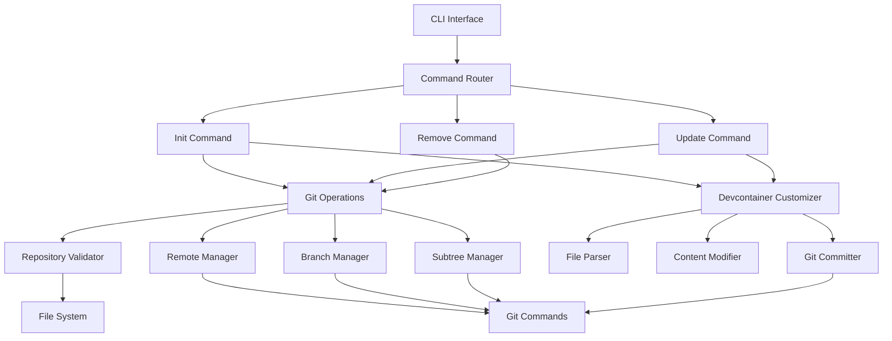

# Design Document

## Overview

The devcontainer-sync-cli is a portable command-line tool built in Go that automates Git subtree operations for integrating Claude Code's devcontainer best practices. The tool provides three main commands: `init`, `update`, and `remove`, each handling different aspects of the devcontainer synchronization lifecycle.

## Architecture

### High-Level Architecture



### Technology Stack

- **Language**: Rust (for cross-platform compatibility, memory safety, and single binary distribution)
- **CLI Framework**: clap (for command structure and flag handling)
- **Git Integration**: Direct git command execution via std::process::Command
- **Testing Framework**: rstest + spectral for RSpec-style BDD testing
- **Configuration**: Embedded constants for Claude repository URL and paths

## Components and Interfaces

### 1. CLI Interface Layer

**Command Structure:**
```
devcontainer-sync init [--verbose] [--strip-firewall]
devcontainer-sync update [--verbose] [--backup] [--force] [--strip-firewall]
devcontainer-sync remove [--verbose] [--keep-files]
devcontainer-sync version
```

**Global Flags:**
- `--verbose, -v`: Enable detailed logging
- `--help, -h`: Display help information

**Command-Specific Flags:**
- `--strip-firewall`: Remove iptables firewall configurations from devcontainer files (init/update only)
- `--backup`: Create backup before update (update only)
- `--force`: Force update even with conflicts (update only)
- `--keep-files`: Keep devcontainer files when removing tracking (remove only)

### 2. Core Components

#### Repository Validator
```rust
pub trait RepositoryValidator {
    fn validate_git_repository(&self, path: &Path) -> Result<(), CliError>;
    fn check_existing_remote(&self, remote_name: &str) -> Result<bool, CliError>;
    fn check_existing_branch(&self, branch_name: &str) -> Result<bool, CliError>;
    fn validate_has_commits(&self) -> Result<(), CliError>;
}
```

**Responsibilities:**
- Verify current directory is a Git repository
- Check for existing Claude remote
- Validate repository state before operations

#### Remote Manager
```rust
pub trait RemoteManager {
    fn add_remote(&self, name: &str, url: &str) -> Result<(), CliError>;
    fn remove_remote(&self, name: &str) -> Result<(), CliError>;
    fn fetch_remote(&self, name: &str) -> Result<(), CliError>;
    fn list_remotes(&self) -> Result<Vec<Remote>, CliError>;
}
```

**Responsibilities:**
- Add/remove Claude Code remote
- Fetch updates from remote repository
- Manage remote configurations

#### Branch Manager
```rust
pub trait BranchManager {
    fn create_branch(&self, name: &str, source: &str) -> Result<(), CliError>;
    fn delete_branch(&self, name: &str) -> Result<(), CliError>;
    fn checkout_branch(&self, name: &str) -> Result<(), CliError>;
    fn list_branches(&self) -> Result<Vec<Branch>, CliError>;
}
```

**Responsibilities:**
- Create and manage tracking branches
- Handle branch switching operations
- Clean up temporary branches

#### Subtree Manager
```rust
pub trait SubtreeManager {
    fn split_subtree(&self, prefix: &str, branch: &str) -> Result<(), CliError>;
    fn add_subtree(&self, prefix: &str, branch: &str, squash: bool) -> Result<(), CliError>;
    fn update_subtree(&self, prefix: &str, branch: &str) -> Result<(), CliError>;
    fn remove_subtree(&self, prefix: &str) -> Result<(), CliError>;
}
```

**Responsibilities:**
- Execute Git subtree operations
- Handle subtree splitting and merging
- Manage .devcontainer directory integration

#### Devcontainer Customizer
```rust
pub trait DevcontainerCustomizer {
    fn strip_firewall_features(&self, devcontainer_path: &Path) -> Result<FirewallRemovalResult, CliError>;
    fn detect_firewall_scripts(&self, devcontainer_path: &Path) -> Result<Vec<PathBuf>, CliError>;
    fn strip_devcontainer_json_firewall(&self, json_path: &Path) -> Result<Vec<String>, CliError>;
    fn strip_dockerfile_firewall(&self, dockerfile_path: &Path) -> Result<Vec<String>, CliError>;
    fn validate_firewall_removal(&self, removal_result: &FirewallRemovalResult) -> Vec<String>;
    fn create_rollback_checkpoint(&self, devcontainer_path: &Path) -> Result<CheckpointId, CliError>;
    fn rollback_changes(&self, checkpoint_id: CheckpointId) -> Result<(), CliError>;
    fn validate_devcontainer_functionality(&self, devcontainer_path: &Path) -> Result<ValidationResult, CliError>;
    fn commit_customizations(&self, changes: &[String], message: &str) -> Result<(), CliError>;
}

#[derive(Debug, Clone)]
pub struct FirewallRemovalResult {
    pub files_modified: Vec<PathBuf>,
    pub files_removed: Vec<PathBuf>,
    pub dockerfile_changes: Vec<String>,
    pub json_changes: Vec<String>,
    pub warnings: Vec<String>,
    pub patterns_not_found: Vec<String>,
    pub checkpoint_id: Option<CheckpointId>,
}

#[derive(Debug, Clone)]
pub enum FirewallPatternType {
    InitFirewallScript,
    DevcontainerJsonFirewall,
    DockerfileFirewallSetup,
    FirewallEnvVar,
}
```

**Responsibilities:**
- Create rollback checkpoints before any firewall modifications
- Detect firewall-related scripts using flexible pattern matching rather than hardcoded filenames
- Strip firewall-related keys from devcontainer.json using pattern-based detection
- Remove firewall capabilities from runArgs using regex patterns
- Remove firewall packages from Dockerfile apt install commands using flexible matching
- Remove firewall setup sections from Dockerfile using section markers and pattern detection
- Validate removal results and report warnings when expected patterns aren't found
- Validate devcontainer functionality after modifications
- Rollback all changes if any critical failures occur
- Provide graceful degradation when upstream firewall implementation changes
- Create git commits documenting the specific firewall removal changes and any warnings

### 3. Configuration Management

**Constants:**
```rust
pub const CLAUDE_REMOTE_NAME: &str = "claude";
pub const CLAUDE_REPO_URL: &str = "https://github.com/anthropics/claude-code.git";
pub const CLAUDE_BRANCH_NAME: &str = "claude-main";
pub const DEVCONTAINER_BRANCH: &str = "devcontainer";
pub const DEVCONTAINER_PREFIX: &str = ".devcontainer";
pub const DEFAULT_TIMEOUT_SECS: u64 = 30;

// Firewall stripping patterns - configurable for upstream changes
pub const FIREWALL_PACKAGE_PATTERNS: &[&str] = &[
    r"iptables\s*\\?",
    r"ipset\s*\\?",
    r"iproute2\s*\\?",
    r"dnsutils\s*\\?",
    r"aggregate\s*\\?"
];

pub const FIREWALL_CAPABILITY_PATTERNS: &[&str] = &[
    r"--cap-add=NET_ADMIN",
    r"--cap-add=NET_RAW"
];

// Flexible patterns for firewall script detection
pub const FIREWALL_SCRIPT_PATTERNS: &[&str] = &[
    r"init-firewall\.sh",
    r"firewall.*\.sh",
    r"iptables.*\.sh"
];

pub const FIREWALL_JSON_KEY_PATTERNS: &[&str] = &[
    r"postStartCommand.*firewall",
    r"waitFor.*postStartCommand"
];

pub const DOCKERFILE_FIREWALL_SECTION_MARKERS: &[&str] = &[
    "# Copy and set up firewall script",
    "COPY.*firewall.*sh",
    "sudoers.*firewall"
];
    "RUN chmod +x /usr/local/bin/init-firewall.sh",
    "echo \"node ALL=(root) NOPASSWD: /usr/local/bin/init-firewall.sh\"",
    "/etc/sudoers.d/node-firewall",
    "chmod 0440 /etc/sudoers.d/node-firewall"
];
```

## Data Models

### Command Context
```rust
pub struct CommandContext {
    pub working_dir: PathBuf,
    pub verbose: bool,
    pub strip_firewall: bool,
    pub timeout: Duration,
    pub git_executor: Box<dyn GitExecutor>,
    pub customizer: Box<dyn DevcontainerCustomizer>,
}
```

### Operation Result
```rust
pub struct OperationResult {
    pub success: bool,
    pub message: String,
    pub changes: Vec<String>,
    pub warnings: Vec<String>,
    pub errors: Vec<CliError>,
    pub customizations: Vec<CustomizationResult>,
}

pub struct CustomizationResult {
    pub file_path: PathBuf,
    pub modifications: Vec<String>,
    pub removal_result: FirewallRemovalResult,
}
```

### Git Command Wrapper
```rust
pub struct GitCommand {
    pub args: Vec<String>,
    pub working_dir: PathBuf,
    pub timeout: Duration,
    pub output: String,
    pub error: Option<CliError>,
}
```

## Resilience to Upstream Changes

### Pattern-Based Detection Strategy

The firewall stripping functionality uses flexible pattern matching rather than hardcoded strings to handle upstream changes in the Claude Code devcontainer implementation:

1. **Regex Patterns**: Use regular expressions for package detection, capability matching, and script identification
2. **Section Markers**: Identify firewall sections in Dockerfiles using comment markers and logical groupings
3. **Validation and Reporting**: Report when expected patterns aren't found, allowing users to understand what wasn't stripped
4. **Graceful Degradation**: Continue operation even when some patterns don't match, rather than failing completely

### Future Extensibility

The design anticipates future enhancements:
- **Configuration Files**: Patterns could be externalized to configuration files for updates without code changes
- **AI-Assisted Updates**: Future CI integration could use AI agents to detect upstream changes and update patterns
- **Pattern Learning**: The tool could learn new patterns from user feedback or upstream analysis

## Correctness Properties

*A property is a characteristic or behavior that should hold true across all valid executions of a system-essentially, a formal statement about what the system should do. Properties serve as the bridge between human-readable specifications and machine-verifiable correctness guarantees.*

Property 1: Firewall pattern detection and removal
*For any* devcontainer configuration containing firewall-related patterns, when processed with the --strip-firewall flag, all detected firewall patterns should be removed while preserving non-firewall functionality
**Validates: Requirements 5.1, 5.2**

Property 2: Graceful handling of missing patterns
*For any* devcontainer configuration where some expected firewall patterns are not found, the tool should continue processing other patterns and report what was not found rather than failing completely
**Validates: Requirements 5.3, 5.5**

Property 3: Customization creates git commit with warnings
*For any* devcontainer customization operation that modifies files, a git commit should be created with a descriptive message including any warnings about patterns that weren't found
**Validates: Requirements 5.4**

Property 4: Modifications are logged with validation results
*For any* execution with the --strip-firewall flag, all modifications and validation results (including missing patterns) should be logged for user review
**Validates: Requirements 5.5**

Property 5: Non-firewall functionality preservation with validation
*For any* devcontainer configuration, after applying firewall stripping, all non-firewall functionality should remain intact and the tool should validate this preservation
**Validates: Requirements 5.6**

Property 6: Rollback on failure
*For any* firewall stripping operation that encounters critical failures, all changes should be rolled back to the pre-modification state, leaving the repository unchanged
**Validates: Requirements 5.1, 5.2, 5.3, 5.4, 5.5, 5.6**
**Validates: Requirements 5.4**

Property 5: Modifications are logged
*For any* execution with the --strip-firewall flag that modifies files, all modifications should be logged with specific details about which files and configurations were removed
**Validates: Requirements 5.5**

Property 6: Non-firewall functionality preservation
*For any* devcontainer configuration, after applying firewall stripping, all non-firewall development environment functionality should remain intact and operational
**Validates: Requirements 5.6**

## Error Handling

### Error Categories

1. **Repository Errors**: Invalid Git repository, missing .git directory
2. **Network Errors**: Failed to fetch from remote, connection timeouts
3. **Git Operation Errors**: Merge conflicts, invalid branches, permission issues
4. **File System Errors**: Permission denied, disk space, file locks
5. **Customization Errors**: Firewall stripping failures, pattern detection issues, rollback failures

### Error Response Strategy

```rust
#[derive(Debug, thiserror::Error)]
pub enum CliError {
    #[error("Repository error: {message}")]
    Repository { message: String, suggestion: String },
    #[error("Network error: {message}")]
    Network { message: String, suggestion: String },
    #[error("Git operation error: {message}")]
    GitOperation { message: String, suggestion: String },
    #[error("File system error: {message}")]
    FileSystem { message: String, suggestion: String },
    #[error("Customization error: {message}")]
    Customization { message: String, suggestion: String, rollback_attempted: bool },
}

impl CliError {
    pub fn exit_code(&self) -> i32 {
        match self {
            CliError::Repository { .. } => 1,
            CliError::Network { .. } => 2,
            CliError::GitOperation { .. } => 3,
            CliError::FileSystem { .. } => 4,
            CliError::Customization { .. } => 5,
        }
    }
}
```

**Error Handling Patterns:**
- Validate preconditions before executing operations
- Provide specific error messages with actionable suggestions
- Implement retry logic for transient network failures
- Create rollback mechanisms for failed operations

### Recovery Mechanisms

1. **Backup Creation**: Automatically backup existing .devcontainer before modifications
2. **Rollback Operations**: Restore previous state on critical failures
3. **Cleanup Procedures**: Remove temporary branches and remotes on exit
4. **State Validation**: Verify repository state after each major operation

### Firewall Stripping Rollback Strategy

**Transaction-like Behavior:**
- All firewall stripping operations must complete successfully or be fully reverted
- Create git stash of all changes before starting firewall modifications
- Track all file modifications in a rollback log
- On any failure, restore files from backup and reset git state

**Rollback Triggers:**
- Pattern detection fails catastrophically (no firewall patterns found when expected)
- File modification errors (permission denied, file corruption)
- Git commit creation fails
- Post-modification validation fails (devcontainer becomes non-functional)

**Rollback Implementation:**
```rust
pub trait RollbackManager {
    fn create_checkpoint(&self, devcontainer_path: &Path) -> Result<CheckpointId, CliError>;
    fn rollback_to_checkpoint(&self, checkpoint_id: CheckpointId) -> Result<(), CliError>;
    fn validate_post_modification(&self, devcontainer_path: &Path) -> Result<ValidationResult, CliError>;
    fn cleanup_checkpoint(&self, checkpoint_id: CheckpointId) -> Result<(), CliError>;
}

#[derive(Debug, Clone)]
pub struct CheckpointId(String);

#[derive(Debug, Clone)]
pub struct ValidationResult {
    pub is_valid: bool,
    pub errors: Vec<String>,
    pub warnings: Vec<String>,
}
```

**Failure Modes and Responses:**
- **Partial Pattern Detection**: Warn user but continue (graceful degradation)
- **File System Errors**: Immediate rollback and clear error message
- **Git Operation Failures**: Rollback file changes and report git issue
- **Validation Failures**: Rollback and suggest manual inspection

## Testing Strategy

### Unit Testing
- Mock Git command execution for isolated testing using mockall crate
- Test each component trait independently
- Validate error handling and edge cases
- Test cross-platform path handling
- Test firewall pattern detection and removal logic

### Property-Based Testing
- Use `proptest` crate for property-based testing with minimum 100 iterations per test
- Each property-based test must be tagged with a comment referencing the design document property
- Tag format: `**Feature: devcontainer-sync-cli, Property {number}: {property_text}**`
- Test firewall stripping across various devcontainer file formats and content patterns
- Generate random devcontainer configurations to validate preservation of non-firewall functionality

### Integration Testing
- Test against real Git repositories
- Validate complete command workflows
- Test with various repository states (clean, dirty, conflicted)
- Verify cleanup operations

### Acceptance Testing (RSpec-style with rstest + spectral)

**Test Framework Design:**
```rust
use rstest::*;
use spectral::prelude::*;
use tempfile::TempDir;

#[fixture]
fn temp_git_repo_with_commits() -> (TempDir, PathBuf) {
    // Setup git repo with commits
}

#[fixture]
fn temp_git_repo_without_commits() -> (TempDir, PathBuf) {
    // Setup empty git repo
}

#[fixture]
fn temp_non_git_dir() -> (TempDir, PathBuf) {
    // Setup regular directory
}

#[fixture]
fn compiled_binary() -> PathBuf {
    // Compile and return binary path
}

#[fixture]
fn devcontainer_with_firewall() -> (TempDir, PathBuf) {
    // Setup devcontainer files with iptables configurations
}

#[fixture]
fn devcontainer_without_firewall() -> (TempDir, PathBuf) {
    // Setup clean devcontainer files
}
```

**Required Acceptance Test Cases:**

```rust
#[rstest]
fn should_fail_when_not_a_git_repository(
    temp_non_git_dir: (TempDir, PathBuf),
    compiled_binary: PathBuf
) {
    let (_temp_dir, dir_path) = temp_non_git_dir;

    let result = run_command(&compiled_binary, &["init"], &dir_path);

    assert_that(&result.exit_code).is_not_equal_to(0);
    assert_that(&result.stderr).contains("not a git repository");
}

#[rstest]
fn should_fail_when_git_repo_has_no_commits(
    temp_git_repo_without_commits: (TempDir, PathBuf),
    compiled_binary: PathBuf
) {
    let (_temp_dir, repo_path) = temp_git_repo_without_commits;

    let result = run_command(&compiled_binary, &["init"], &repo_path);

    assert_that(&result.exit_code).is_not_equal_to(0);
    assert_that(&result.stderr).contains("no commits found");
}

#[rstest]
fn should_succeed_when_git_repo_has_commits(
    temp_git_repo_with_commits: (TempDir, PathBuf),
    compiled_binary: PathBuf
) {
    let (_temp_dir, repo_path) = temp_git_repo_with_commits;

    let result = run_command(&compiled_binary, &["init"], &repo_path);

    assert_that(&result.exit_code).is_equal_to(0);
    assert_that(&result.stdout).contains("Successfully initialized");
}

#[rstest]
fn should_strip_firewall_when_flag_provided(
    temp_git_repo_with_commits: (TempDir, PathBuf),
    devcontainer_with_firewall: (TempDir, PathBuf),
    compiled_binary: PathBuf
) {
    let (_temp_dir, repo_path) = temp_git_repo_with_commits;
    let (_dc_temp, dc_path) = devcontainer_with_firewall;

    // Copy devcontainer files to repo
    copy_devcontainer_files(&dc_path, &repo_path);

    let result = run_command(&compiled_binary, &["init", "--strip-firewall"], &repo_path);

    assert_that(&result.exit_code).is_equal_to(0);
    assert_that(&result.stdout).contains("Stripped firewall configurations");

    // Verify iptables commands are removed
    let dockerfile_content = read_file(&repo_path.join(".devcontainer/Dockerfile"));
    assert_that(&dockerfile_content).does_not_contain("iptables");
}

#[rstest]
fn should_preserve_firewall_when_flag_not_provided(
    temp_git_repo_with_commits: (TempDir, PathBuf),
    devcontainer_with_firewall: (TempDir, PathBuf),
    compiled_binary: PathBuf
) {
    let (_temp_dir, repo_path) = temp_git_repo_with_commits;
    let (_dc_temp, dc_path) = devcontainer_with_firewall;

    copy_devcontainer_files(&dc_path, &repo_path);

    let result = run_command(&compiled_binary, &["init"], &repo_path);

    assert_that(&result.exit_code).is_equal_to(0);

    // Verify iptables commands are preserved
    let dockerfile_content = read_file(&repo_path.join(".devcontainer/Dockerfile"));
    assert_that(&dockerfile_content).contains("iptables");
}

#[rstest]
fn should_create_commit_after_firewall_stripping(
    temp_git_repo_with_commits: (TempDir, PathBuf),
    devcontainer_with_firewall: (TempDir, PathBuf),
    compiled_binary: PathBuf
) {
    let (_temp_dir, repo_path) = temp_git_repo_with_commits;
    let (_dc_temp, dc_path) = devcontainer_with_firewall;

    copy_devcontainer_files(&dc_path, &repo_path);

    let result = run_command(&compiled_binary, &["init", "--strip-firewall"], &repo_path);

    assert_that(&result.exit_code).is_equal_to(0);

    // Verify git commit was created
    let git_log = run_git_command(&["log", "--oneline", "-1"], &repo_path);
    assert_that(&git_log.stdout).contains("Stripped firewall configurations");
}
```

**Test Harness Features:**
- `rstest` fixtures for automatic setup/teardown of temporary directories
- `spectral` assertions for fluent, readable test expectations
- Binary compilation and caching using `once_cell` for test runs
- Isolated test environments via `rstest` fixtures
- Custom helper functions for command execution and result validation

### End-to-End Testing
- Test full init → update → remove lifecycle
- Validate against actual Claude Code repository (in CI only)
- Test error scenarios and recovery
- Performance testing for timeout compliance

### Test Data Management
- Create minimal test repositories for consistent testing
- Mock network operations for reliable CI/CD using wiremock-rs
- Test with different Git versions and configurations

## Performance Considerations

### Optimization Strategies

1. **Shallow Clones**: Use shallow fetch when full history isn't needed
2. **Progress Reporting**: Provide real-time feedback for long operations
3. **Timeout Management**: Implement reasonable timeouts with user override options
4. **Efficient Git Commands**: Use minimal Git operations and avoid unnecessary repository scans

### Resource Management

- Limit memory usage during large repository operations
- Clean up temporary files and branches promptly
- Execute Git operations sequentially to maintain repository consistency
- Monitor and report disk space requirements

## Security Considerations

### Input Validation
- Sanitize all user inputs and file paths
- Validate Git repository URLs and branch names
- Prevent command injection through Git arguments

### File System Security
- Respect existing file permissions
- Validate write permissions before operations
- Prevent directory traversal attacks
- Handle symbolic links safely

### Network Security
- Use HTTPS for all remote operations
- Validate SSL certificates
- Implement timeout protections against slow networks
- Log security-relevant operations for audit trails
