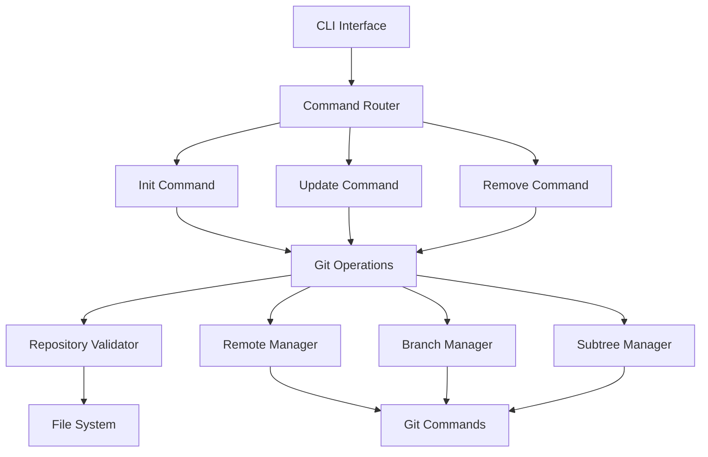

# Design Document

## Overview

The devcontainer-sync-cli is a portable command-line tool built in Go that automates Git subtree operations for integrating Claude Code's devcontainer best practices. The tool provides three main commands: `init`, `update`, and `remove`, each handling different aspects of the devcontainer synchronization lifecycle.

## Architecture

### High-Level Architecture



### Technology Stack

- **Language**: Rust (for cross-platform compatibility, memory safety, and single binary distribution)
- **CLI Framework**: clap (for command structure and flag handling)
- **Git Integration**: Direct git command execution via std::process::Command
- **Testing Framework**: rstest + spectral for RSpec-style BDD testing
- **Configuration**: Embedded constants for Claude repository URL and paths

## Components and Interfaces

### 1. CLI Interface Layer

**Command Structure:**
```
devcontainer-sync init [--verbose]
devcontainer-sync update [--verbose] [--backup] [--force]
devcontainer-sync remove [--verbose] [--keep-files]
devcontainer-sync version
```

**Global Flags:**
- `--verbose, -v`: Enable detailed logging
- `--help, -h`: Display help information

### 2. Core Components

#### Repository Validator
```rust
pub trait RepositoryValidator {
    fn validate_git_repository(&self, path: &Path) -> Result<(), CliError>;
    fn check_existing_remote(&self, remote_name: &str) -> Result<bool, CliError>;
    fn check_existing_branch(&self, branch_name: &str) -> Result<bool, CliError>;
    fn validate_has_commits(&self) -> Result<(), CliError>;
}
```

**Responsibilities:**
- Verify current directory is a Git repository
- Check for existing Claude remote
- Validate repository state before operations

#### Remote Manager
```rust
pub trait RemoteManager {
    fn add_remote(&self, name: &str, url: &str) -> Result<(), CliError>;
    fn remove_remote(&self, name: &str) -> Result<(), CliError>;
    fn fetch_remote(&self, name: &str) -> Result<(), CliError>;
    fn list_remotes(&self) -> Result<Vec<Remote>, CliError>;
}
```

**Responsibilities:**
- Add/remove Claude Code remote
- Fetch updates from remote repository
- Manage remote configurations

#### Branch Manager
```rust
pub trait BranchManager {
    fn create_branch(&self, name: &str, source: &str) -> Result<(), CliError>;
    fn delete_branch(&self, name: &str) -> Result<(), CliError>;
    fn checkout_branch(&self, name: &str) -> Result<(), CliError>;
    fn list_branches(&self) -> Result<Vec<Branch>, CliError>;
}
```

**Responsibilities:**
- Create and manage tracking branches
- Handle branch switching operations
- Clean up temporary branches

#### Subtree Manager
```rust
pub trait SubtreeManager {
    fn split_subtree(&self, prefix: &str, branch: &str) -> Result<(), CliError>;
    fn add_subtree(&self, prefix: &str, branch: &str, squash: bool) -> Result<(), CliError>;
    fn update_subtree(&self, prefix: &str, branch: &str) -> Result<(), CliError>;
    fn remove_subtree(&self, prefix: &str) -> Result<(), CliError>;
}
```

**Responsibilities:**
- Execute Git subtree operations
- Handle subtree splitting and merging
- Manage .devcontainer directory integration

### 3. Configuration Management

**Constants:**
```rust
pub const CLAUDE_REMOTE_NAME: &str = "claude";
pub const CLAUDE_REPO_URL: &str = "https://github.com/anthropics/claude-code.git";
pub const CLAUDE_BRANCH_NAME: &str = "claude-main";
pub const DEVCONTAINER_BRANCH: &str = "devcontainer";
pub const DEVCONTAINER_PREFIX: &str = ".devcontainer";
pub const DEFAULT_TIMEOUT_SECS: u64 = 30;
```

## Data Models

### Command Context
```rust
pub struct CommandContext {
    pub working_dir: PathBuf,
    pub verbose: bool,
    pub timeout: Duration,
    pub git_executor: Box<dyn GitExecutor>,
}
```

### Operation Result
```rust
pub struct OperationResult {
    pub success: bool,
    pub message: String,
    pub changes: Vec<String>,
    pub warnings: Vec<String>,
    pub errors: Vec<CliError>,
}
```

### Git Command Wrapper
```rust
pub struct GitCommand {
    pub args: Vec<String>,
    pub working_dir: PathBuf,
    pub timeout: Duration,
    pub output: String,
    pub error: Option<CliError>,
}
```

## Error Handling

### Error Categories

1. **Repository Errors**: Invalid Git repository, missing .git directory
2. **Network Errors**: Failed to fetch from remote, connection timeouts
3. **Git Operation Errors**: Merge conflicts, invalid branches, permission issues
4. **File System Errors**: Permission denied, disk space, file locks

### Error Response Strategy

```rust
#[derive(Debug, thiserror::Error)]
pub enum CliError {
    #[error("Repository error: {message}")]
    Repository { message: String, suggestion: String },
    #[error("Network error: {message}")]
    Network { message: String, suggestion: String },
    #[error("Git operation error: {message}")]
    GitOperation { message: String, suggestion: String },
    #[error("File system error: {message}")]
    FileSystem { message: String, suggestion: String },
}

impl CliError {
    pub fn exit_code(&self) -> i32 {
        match self {
            CliError::Repository { .. } => 1,
            CliError::Network { .. } => 2,
            CliError::GitOperation { .. } => 3,
            CliError::FileSystem { .. } => 4,
        }
    }
}
```

**Error Handling Patterns:**
- Validate preconditions before executing operations
- Provide specific error messages with actionable suggestions
- Implement retry logic for transient network failures
- Create rollback mechanisms for failed operations

### Recovery Mechanisms

1. **Backup Creation**: Automatically backup existing .devcontainer before modifications
2. **Rollback Operations**: Restore previous state on critical failures
3. **Cleanup Procedures**: Remove temporary branches and remotes on exit
4. **State Validation**: Verify repository state after each major operation

## Testing Strategy

### Unit Testing
- Mock Git command execution for isolated testing using mockall crate
- Test each component trait independently
- Validate error handling and edge cases
- Test cross-platform path handling

### Integration Testing
- Test against real Git repositories
- Validate complete command workflows
- Test with various repository states (clean, dirty, conflicted)
- Verify cleanup operations

### Acceptance Testing (RSpec-style with rstest + spectral)

**Test Framework Design:**
```rust
use rstest::*;
use spectral::prelude::*;
use tempfile::TempDir;

#[fixture]
fn temp_git_repo_with_commits() -> (TempDir, PathBuf) {
    // Setup git repo with commits
}

#[fixture]
fn temp_git_repo_without_commits() -> (TempDir, PathBuf) {
    // Setup empty git repo
}

#[fixture]
fn temp_non_git_dir() -> (TempDir, PathBuf) {
    // Setup regular directory
}

#[fixture]
fn compiled_binary() -> PathBuf {
    // Compile and return binary path
}
```

**Required Acceptance Test Cases:**

```rust
#[rstest]
fn should_fail_when_not_a_git_repository(
    temp_non_git_dir: (TempDir, PathBuf),
    compiled_binary: PathBuf
) {
    let (_temp_dir, dir_path) = temp_non_git_dir;

    let result = run_command(&compiled_binary, &["init"], &dir_path);

    assert_that(&result.exit_code).is_not_equal_to(0);
    assert_that(&result.stderr).contains("not a git repository");
}

#[rstest]
fn should_fail_when_git_repo_has_no_commits(
    temp_git_repo_without_commits: (TempDir, PathBuf),
    compiled_binary: PathBuf
) {
    let (_temp_dir, repo_path) = temp_git_repo_without_commits;

    let result = run_command(&compiled_binary, &["init"], &repo_path);

    assert_that(&result.exit_code).is_not_equal_to(0);
    assert_that(&result.stderr).contains("no commits found");
}

#[rstest]
fn should_succeed_when_git_repo_has_commits(
    temp_git_repo_with_commits: (TempDir, PathBuf),
    compiled_binary: PathBuf
) {
    let (_temp_dir, repo_path) = temp_git_repo_with_commits;

    let result = run_command(&compiled_binary, &["init"], &repo_path);

    assert_that(&result.exit_code).is_equal_to(0);
    assert_that(&result.stdout).contains("Successfully initialized");
}
```

**Test Harness Features:**
- `rstest` fixtures for automatic setup/teardown of temporary directories
- `spectral` assertions for fluent, readable test expectations
- Binary compilation and caching using `once_cell` for test runs
- Isolated test environments via `rstest` fixtures
- Custom helper functions for command execution and result validation

### End-to-End Testing
- Test full init → update → remove lifecycle
- Validate against actual Claude Code repository (in CI only)
- Test error scenarios and recovery
- Performance testing for timeout compliance

### Test Data Management
- Create minimal test repositories for consistent testing
- Mock network operations for reliable CI/CD using wiremock-rs
- Test with different Git versions and configurations

## Performance Considerations

### Optimization Strategies

1. **Shallow Clones**: Use shallow fetch when full history isn't needed
2. **Progress Reporting**: Provide real-time feedback for long operations
3. **Timeout Management**: Implement reasonable timeouts with user override options
4. **Efficient Git Commands**: Use minimal Git operations and avoid unnecessary repository scans

### Resource Management

- Limit memory usage during large repository operations
- Clean up temporary files and branches promptly
- Execute Git operations sequentially to maintain repository consistency
- Monitor and report disk space requirements

## Security Considerations

### Input Validation
- Sanitize all user inputs and file paths
- Validate Git repository URLs and branch names
- Prevent command injection through Git arguments

### File System Security
- Respect existing file permissions
- Validate write permissions before operations
- Prevent directory traversal attacks
- Handle symbolic links safely

### Network Security
- Use HTTPS for all remote operations
- Validate SSL certificates
- Implement timeout protections against slow networks
- Log security-relevant operations for audit trails
