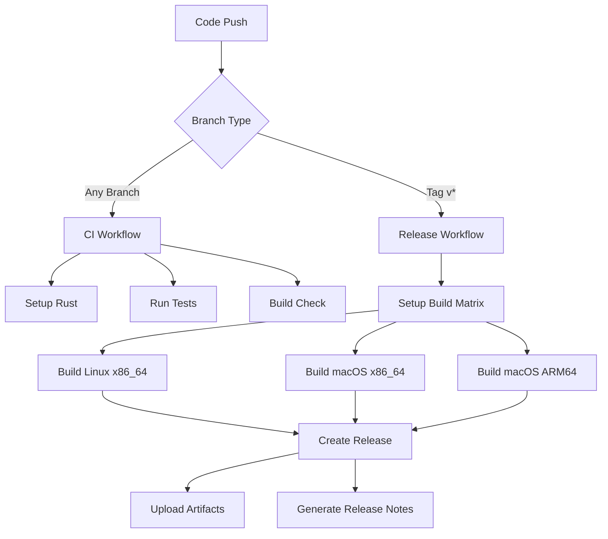

# GitHub Actions CI/CD Design Document

## Overview

This design implements a comprehensive CI/CD pipeline using GitHub Actions for the devcontainer-sync-cli project. The system consists of two primary workflows: a continuous integration workflow that runs on every push, and a release workflow that triggers on version tags. The design emphasizes security, reliability, and cross-platform compatibility while maintaining fast build times.

## Architecture

### Workflow Structure



### File Structure

```
.github/
├── workflows/
│   ├── ci.yml           # Continuous Integration workflow
│   └── release.yml      # Release workflow
└── dependabot.yml       # Dependency updates (optional)
```

## Components and Interfaces

### CI Workflow (ci.yml)

**Purpose**: Validates code quality and functionality on every push

**Triggers**:
- Push to any branch
- Pull request creation/updates

**Jobs**:
1. **test**: Runs on Ubuntu latest
   - Sets up Rust stable toolchain
   - Caches cargo dependencies
   - Runs `cargo test --all-features`
   - Runs `cargo clippy -- -D warnings`
   - Runs `cargo fmt --check`

**Matrix Strategy**: Single job on Ubuntu for speed and cost efficiency

### Release Workflow (release.yml)

**Purpose**: Builds and publishes releases when version tags are created

**Triggers**:
- Push of tags matching `v*` pattern (e.g., v1.0.0, v2.1.3)

**Jobs**:
1. **build**: Matrix job for cross-platform builds
   - **Platforms**:
     - `ubuntu-latest` → `x86_64-unknown-linux-gnu`
     - `macos-latest` → `x86_64-apple-darwin`
     - `macos-latest` → `aarch64-apple-darwin`

2. **release**: Creates GitHub release
   - Depends on successful build completion
   - Downloads all build artifacts
   - Creates release with tag name
   - Uploads binaries with platform-specific names

### Build Matrix Configuration

```yaml
strategy:
  matrix:
    include:
      - os: ubuntu-latest
        target: x86_64-unknown-linux-gnu
        binary-suffix: ""
      - os: macos-latest
        target: x86_64-apple-darwin
        binary-suffix: ""
      - os: macos-latest
        target: aarch64-apple-darwin
        binary-suffix: ""
```

## Data Models

### Artifact Naming Convention

**Pattern**: `devcontainer-sync-{version}-{target}{suffix}`

**Examples**:
- `devcontainer-sync-v1.0.0-x86_64-unknown-linux-gnu`
- `devcontainer-sync-v1.0.0-x86_64-apple-darwin`
- `devcontainer-sync-v1.0.0-aarch64-apple-darwin`

### Environment Variables

```yaml
CARGO_TERM_COLOR: always
RUST_BACKTRACE: 1
```

### Secrets and Permissions

**Required Permissions**:
- `contents: write` - For creating releases and uploading assets
- `actions: read` - For workflow execution

**GitHub Token**: Uses built-in `GITHUB_TOKEN` with automatic permissions

## Error Handling

### Build Failures

**Strategy**: Fail fast with clear error reporting

**Implementation**:
- Each job fails independently
- Matrix builds continue even if one platform fails
- Release job only runs if all builds succeed
- Clear error messages in workflow logs

### Dependency Issues

**Mitigation**:
- Cargo dependency caching with automatic cache invalidation
- Lock file verification
- Dependency audit integration (future enhancement)

### Cross-compilation Issues

**Handling**:
- Use official Rust cross-compilation targets
- Platform-specific build steps where needed
- Fallback strategies for unsupported features

## Testing Strategy

### Pre-release Validation

**CI Workflow Testing**:
- All existing unit tests must pass
- Integration tests execution
- Clippy linting with deny warnings
- Code formatting verification

**Release Workflow Testing**:
- Dry-run capability for testing without publishing
- Artifact validation before upload
- Binary execution smoke tests

### Workflow Testing

**Local Testing**:
- Use `act` tool for local GitHub Actions simulation
- Test matrix configurations locally
- Validate artifact generation

**Staging Process**:
- Test releases using pre-release tags (e.g., v1.0.0-rc1)
- Validate download and execution of generated binaries
- Cross-platform testing of released artifacts

### Security Considerations

**Supply Chain Security**:
- Pin action versions to specific commits
- Use official GitHub-hosted runners only
- Verify checksums of downloaded tools
- Minimal required permissions

**Artifact Integrity**:
- Generate SHA256 checksums for all binaries
- Include checksums in release notes
- Future: Code signing for macOS binaries

## Performance Optimizations

### Build Speed

**Caching Strategy**:
- Cargo registry and git dependencies
- Target directory caching with key rotation
- Rust toolchain caching

**Parallel Execution**:
- Matrix builds run in parallel
- Independent job execution
- Optimized dependency installation

### Resource Usage

**Runner Selection**:
- Use standard GitHub-hosted runners
- Appropriate runner sizing for build requirements
- Cost-effective platform selection

## Integration Points

### Version Management

**Semantic Versioning**:
- Tags must follow `v{major}.{minor}.{patch}` format
- Extract version from git tag for artifact naming
- Validate version format in workflow

### Release Notes

**Automatic Generation**:
- Extract commits since last tag
- Format as markdown list
- Include contributor information
- Link to full changelog

### Cargo.toml Integration

**Version Synchronization**:
- Workflow extracts version from git tag
- No automatic Cargo.toml version updates
- Manual version management in source code
